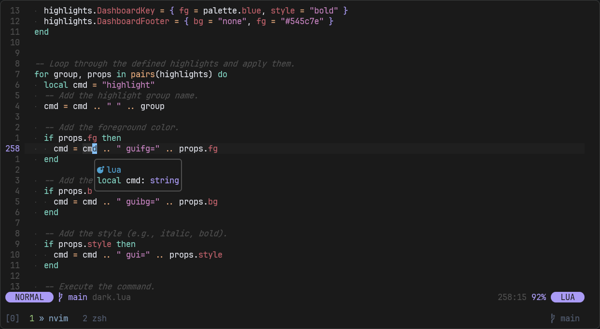
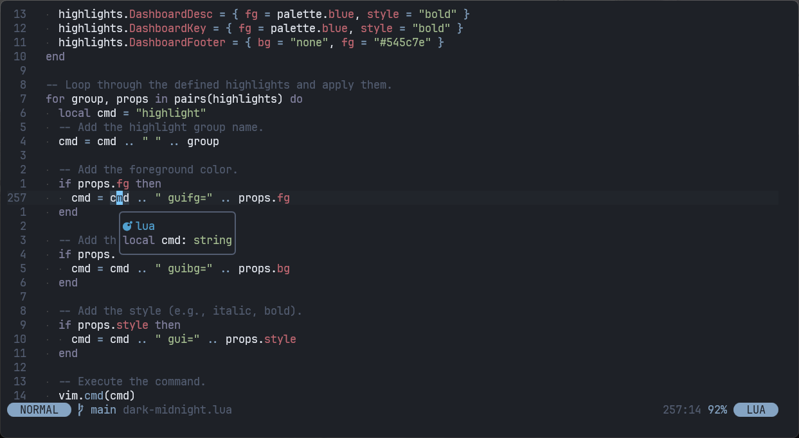

# cursor-dark.nvim

A dark colorscheme for Neovim and Vim inspired by Cursor's dark and dark midnight themes.

## ✨ Features

- **Inspired by Cursor**: A faithful reproduction of the clean, low-contrast color palette found in the Cursor editor.
- **Cross-Platform**: Works on both Neovim (with Lua configuration) and Vim (with Vimscript).
- **Customizable**: Allows for a transparent background and other future customizations via a simple setup function.
- **Tree-sitter Support**: Includes syntax highlighting for common Tree-sitter languages to provide a modern editing experience.
- **Plugin Integration**: Provides sensible defaults and theme overrides for popular plugins like nvimdev/dashboard-nvim to ensure a consistent look.

## 🎁 Bonous Features

- **Terminal Color Scheme**:
    - Alacritty
    - Ghostty
    - Terminal (Windows)

## 📸 Screenshot

Here's a preview of the colorscheme in action.

- Cursor Dark



- Cursor Dark Midnight



## 📦 Installation

Use your favorite plugin manager to install cursor-dark.nvim.

- lazy.nvim

```lua

return {
  -- Your other plugins...

  {
    "ydkulks/cursor-dark.nvim",
    lazy = false,
    priority = 1000,
    config = function()
      -- vim.cmd.colorscheme("cursor-dark-midnight")
      require("cursor-dark").setup({
        -- For theme
        style = "dark-midnight",
        -- For a transparent background
        transparent = true,
        -- If you have dashboard-nvim plugin installed
        dashboard = true,
      })
    end,
  },
}
```

- vim-plug

```vim
" In your .vimrc or init.vim
Plug 'your-github-username/cursor-dark.nvim'

" After installing, add this to your configuration
colorscheme cursor-dark
```

- Manual (vim)
    - Copy the files in `color/` and place them in `~/.vim/colors/` directory

## ⚙️ Configuration

You can customize the colorscheme by passing a table of options to the setup function.

> [!Note]
> If the colors look odd, make sure you have you have configured the terminal's colorscheme to be
> the same colorscheme your using in Neovim

```lua
require("cursor-dark").setup({
  -- Set to `true` to make the background transparent
  transparent = false,
  -- Choose theme
  style = "dark-midnight",
})
```

## 📜 License

This project is licensed under the MIT License. See the [LICENSE](./LICENSE.md) file for details.
